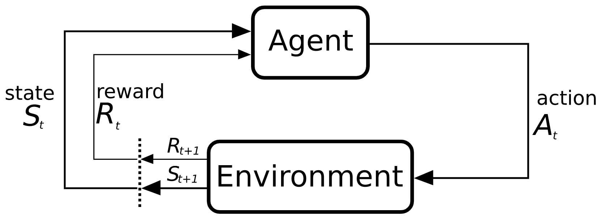

## Introduction 
In Reinforcement Learning problems, Markov Decision Processes (MDPs) describe the change in environment which changes its state in response to agent's actions. The state of the environment affects the immediate reward obtained by the agent, as well as the probabilities of future state transitions. The agent's objective (also called MDP Planning) is to select actions to maximize a long-term measure (generally expectation) of total reward.

## Tasks Implementation
MDP planning 
- Value Iteration
- Howard’s Policy Iteration
- Linear Programming

## Other Details
Each MDP is provided as a text file in the following format.
- numStates S
- numActions A
- end ed1 ed2 ... edn
- transition s1 ac s2 r p
- transition s1 ac s2 r p
- . . .
- transition s1 ac s2 r p
- mdptype MDPtype (episodic or continuing)
- discount gamma

Generate MDP file by using the following command

``python generateMDP.py --S 2 --A 2 --gamma 0.90 --mdptype episodic --rseed 0``

Generate Optimal Value Function of the MDP (located at some path p1) by the algorithm a1 (vi/hpi/lp) using the following command

``python planner.py --mdp p1 --algorithm a1``