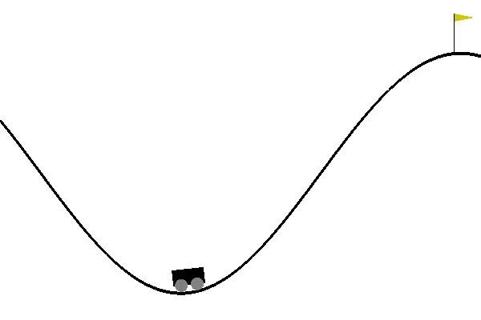

## Introduction 
A car is on a one-dimensional track, positioned between two "mountains". The goal is to drive up the mountain on the right; however, the car's engine is not strong enough to scale the mountain in a single pass. Therefore, the only way to succeed is to drive back and forth to build up momentum.

## Solution
States are discretised and MDP is formulated. Then the optimal policy is found using Tabular Sarsa(0) and Tile Coding. The environment is modelled using [OpenAI gym](https://gym.openai.com/envs/MountainCar-v0/)

## Other Details
To get output plots and weights, run my code by following these commands sequentially in submission directory

	python mountain_car.py --task T1 --train 1

	python mountain_car.py --task T1 --train 0

	python mountain_car.py --task T1 --train 1

	python mountain_car.py --task T1 --train 0